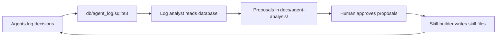

# Agents

Nine agents handle specific stages of the feature pipeline. Each agent has one job, defined inputs, and defined outputs.

## What They Are

Each agent is a Claude Code subagent definition: a markdown file that specifies an identity, a set of tools, and skill files that give the agent project-specific knowledge. Think of them as specialists on a consulting team. The interviewer, the planner, the architect, the engineer, and the three code inspectors each own their domain and do not cross into each other's territory.

## Pipeline Agents

### Discovery

Interviews you to understand what you want to build.

**Reads:** `CLAUDE.md`, `docs/briefs/`, `TODO.md`  
**Writes:** `{NNN}.01-dis-{feature}.md`  
**Cannot:** Read application code, assign feature numbers

The discovery agent asks one or two questions at a time. It explores wide before narrowing. It does not read the codebase. Drawing conclusions from code is the architect's job. When the agent can write every section of the brief without leaving anything blank, it confirms the contents with you before writing.

### Architect

Reads the brief, audits the codebase, writes a feature specification.

**Reads:** Discovery brief, routes, models, controllers, existing specs  
**Writes:** `{NNN}.02-arc-{feature}.md`  
**Cannot:** Modify any application code

The architect checks new URLs against the existing route grammar, checks model names against existing naming conventions, and flags any refactoring that the new feature would make worse if left unaddressed. It presents the full spec scope to you for confirmation before writing the file.

### Design

Expands the spec's behavioral constraints into a full UI/UX design specification.

**Reads:** Feature spec, existing views  
**Writes:** `{NNN}.03-des-{feature}.md`

The design agent covers user flows, screen layouts, component inventory, AI generation surface patterns, and state design for all views. It reads `app/views/` to understand existing layout and component patterns before designing.

### Engineer

Implements the feature using test-driven development.

**Reads:** Feature spec, design spec  
**Writes:** Implementation code + `{NNN}.{SEQ}-eng-{feature}.md`

The engineer writes tests first, runs them red, writes the minimum code to go green, then refactors. Every non-trivial decision is logged to the agent database. At the end, the engineer writes a report that names deliberate tradeoffs, assumptions, and areas of uncertainty for the review agents to examine.

### Code Review

Checks code quality: Rails conventions, test coverage, naming, and design system compliance.

**Reads:** Feature spec, engineer report  
**Writes:** `{NNN}.{SEQ+1}-cr-{feature}.md`  
**Verdict:** PASS, PASS WITH NOTES, or NEEDS WORK

### Security Review

Checks for authorization scope, mass assignment, injection, and sensitive data exposure.

**Reads:** Feature spec, engineer report  
**Writes:** `{NNN}.{SEQ+2}-sec-{feature}.md`  
**Verdict:** PASS, PASS WITH NOTES, or NEEDS WORK

### Performance Review

Checks for N+1 queries, missing indexes, blocking callbacks, and unscoped collections.

**Reads:** Feature spec, engineer report  
**Writes:** `{NNN}.{SEQ+3}-perf-{feature}.md`  
**Verdict:** PASS, PASS WITH NOTES, or NEEDS WORK

## Learning Loop Agents

These two agents run outside the feature pipeline. They read accumulated data and improve the other agents over time.

### Log Analyst

Reads the agent database and proposes specific improvements to agent rules.

**Reads:** `db/agent_log.sqlite3`, current agent definitions  
**Writes:** `docs/agent-analysis/YYYY-MM-DD.md`  
**Cannot:** Modify any agent or skill file

Run the log analyst after 10 to 15 completed feature cycles. It looks for six pattern types: decisions that should become standing rules, alternatives that should be documented as anti-patterns, engineer decisions that the architect should have made instead, expected vs. observed outcome mismatches, practices that correlate with high-quality runs, and finding categories that recur across multiple features.

### Skill Builder

Executes confirmed proposals from a log-analyst report.

**Reads:** A log-analyst report, current skill and agent files  
**Writes:** New skill files, updated agent frontmatter

The skill builder does not approve its own proposals. You review each proposal and confirm which to build. Proposals with high confidence (recurring across 5 or more features) are pre-approved by default. Proposals with medium confidence (3 to 4 features) require per-item confirmation.

## How the Learning Loop Works

Here is how the agents improve over time:

Every agent logs decisions, events, struggles, and skill gaps to the SQLite database during each session. After enough cycles, the log analyst can find recurring patterns. The approved changes become skill files that every agent loads at the start of the next session.

## Skills

Six skill files give agents project-specific knowledge that training data alone would not provide:

| Skill | What it contains |
|---|---|
| `agent-log` | CLI syntax and flag reference for `bin/agent-log` |
| `rails-principles` | Rails-first design rules, naming conventions, approved dependencies |
| `design-system` | Visual grammar rules, AI generation trigger UX contract |
| `architect-spec-format` | The specification template and field descriptions |
| `discovery-brief-format` | The brief template and field descriptions |
| `writer-design-system` | Project-specific design system classes |

New skill files are added by the skill builder as the learning loop matures.
