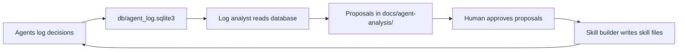

# Agents

Thirteen agents handle specific stages of the feature pipeline, the learning loop, backlog strategy, or intake. Each agent has one job, defined inputs, and defined outputs.

## What They Are

Each agent is a Claude Code subagent definition: a markdown file that specifies an identity, a set of tools, and skill files that give the agent project-specific knowledge. Think of them as specialists on a consulting team. The interviewer, the planner, the architect, the engineer, and the four code inspectors each own their domain and do not cross into each other's territory.

## Pipeline Agents

### Discovery

Interviews you to understand what you want to build.

**Reads:** `AGENTS.md`, `docs/briefs/`, `TODO.md`  
**Writes:** `{NNN}.01-dis-{feature}.md`  
**Cannot:** Read application code, assign feature numbers

The discovery agent asks one or two questions at a time. It explores wide before narrowing. It does not read the codebase. Drawing conclusions from code is the architect's job. When the agent can write every section of the brief without leaving anything blank, it confirms the contents with you before writing.

### Architect

Reads the brief, audits the codebase, writes a feature specification.

**Reads:** Discovery brief, routes, models, controllers, existing specs  
**Writes:** `{NNN}.02-arc-{feature}.md`  
**Cannot:** Modify any application code

The architect checks new URLs against the existing route grammar, checks model names against existing naming conventions, and flags any refactoring that the new feature would make worse if left unaddressed. It presents the full spec scope to you for confirmation before writing the file.

### Design

Expands the spec's behavioral constraints into a full UI/UX design specification.

**Reads:** Feature spec, existing views  
**Writes:** `{NNN}.03-des-{feature}.md`

The design agent covers user flows, screen layouts, component inventory, AI generation surface patterns, and state design for all views. It reads `app/views/` to understand existing layout and component patterns before designing.

### Engineer

Implements the feature using test-driven development.

**Reads:** Feature spec, design spec  
**Writes:** Implementation code + `{NNN}.{SEQ}-eng-{feature}.md`

The engineer writes tests first, runs them red, writes the minimum code to go green, then refactors. Every non-trivial decision is logged to the agent database. At the end, the engineer writes a report that names deliberate tradeoffs, assumptions, and areas of uncertainty for the review agents to examine.

### Code Review

Checks code quality: Rails conventions, test coverage, naming, and design system compliance.

**Reads:** Feature spec, engineer report  
**Writes:** `{NNN}.{SEQ+1}-cr-{feature}.md`  
**Verdict:** PASS, PASS WITH NOTES, or NEEDS WORK

### Security Review

Checks for authorization scope, mass assignment, injection, and sensitive data exposure.

**Reads:** Feature spec, engineer report  
**Writes:** `{NNN}.{SEQ+2}-sec-{feature}.md`  
**Verdict:** PASS, PASS WITH NOTES, or NEEDS WORK

### Performance Review

Checks for N+1 queries, missing indexes, blocking callbacks, and unscoped collections.

**Reads:** Feature spec, engineer report  
**Writes:** `{NNN}.{SEQ+3}-perf-{feature}.md`  
**Verdict:** PASS, PASS WITH NOTES, or NEEDS WORK

### Fidelity Review

Checks whether the implementation still matches the plan's intent, and whether the plan actually addresses the problem the discovery brief described. Does not check code quality, security, or performance — this is the only reviewer that reads backward across the whole chain instead of forward into one artifact.

**Reads:** Discovery brief, feature spec, engineer report  
**Writes:** `{NNN}.{SEQ+4}-fid-{feature}.md`  
**Verdict:** PASS, PASS WITH NOTES, or NEEDS WORK

## Learning Loop Agents

These two agents run outside the feature pipeline. They read accumulated data and improve the other agents over time.

### Log Analyst

Reads the agent database and proposes specific improvements to agent rules.

**Reads:** `db/agent_log.sqlite3`, current agent definitions  
**Writes:** `docs/agent-analysis/YYYY-MM-DD.md`  
**Cannot:** Modify any agent or skill file

Run the log analyst after `cadence.log_analyst_interval` completed cycles (`team.yml`; 15 by default — feature and bug fix cycles both count). It looks for six pattern types: decisions that should become standing rules, alternatives that should be documented as anti-patterns, engineer decisions that the architect should have made instead, expected vs. observed outcome mismatches, practices that correlate with high-quality runs, and finding categories that recur across multiple features.

You don't have to track the cycle count yourself — the orchestrator does, as the last thing it does at the end of every pipeline or bug fix run (Stage 9 / Stage B10 in `docs/pipeline.md`), and mentions it in the final report once the threshold has passed since the last `docs/agent-analysis/` report. It never runs `log-analyst` for you; it only tells you when it's worth doing yourself.

### Skill Builder

Executes confirmed proposals from a log-analyst report.

**Reads:** A log-analyst report, current skill and agent files  
**Writes:** New skill files, updated agent frontmatter

The skill builder does not approve its own proposals. You review each proposal and confirm which to build. Proposals with high confidence (recurring across 5 or more features) are pre-approved by default. Proposals with medium confidence (3 to 4 features) require per-item confirmation.

## How the Learning Loop Works

Here is how the agents improve over time:

```mermaid
flowchart LR
    A[Agents log decisions] --> B[db/agent_log.sqlite3]
    B --> C[Log analyst reads database]
    C --> D[Proposals in docs/agent-analysis/]
    D --> E[Human approves proposals]
    E --> F[Skill builder writes skill files]
    F --> A
```

Every agent logs decisions, events, struggles, and skill gaps to the SQLite database during each session. After enough cycles, the log analyst can find recurring patterns. The approved changes become skill files that every agent loads at the start of the next session.

## Strategy Agents

These two agents run outside the feature pipeline too, but neither is part of the learning loop — they don't read agent behavior, they read the product backlog and the bug queue.

### Roadmap Analyst

Reads `TODO.md`'s `Needs Discovery` and `Tech Debt` sections, every persona file under `docs/icp/`, and the codebase, and proposes a build order.

**Reads:** `TODO.md`, `docs/icp/*-icp.md`, `app/models/`, `config/routes.rb`, `db/schema.rb`, `docs/briefs/`  
**Writes:** `docs/roadmap.md`  
**Cannot:** Modify `TODO.md`, any file under `docs/icp/`, or application code — the one exception is appending a single new backlog entry it surfaced itself, and only after the user confirms it live

Run it via `/roadmap`, on demand — not part of `/feature`. It orders the backlog on two independent axes: technical dependency (does this need something that doesn't exist yet) and product value (does this serve a persona `docs/icp/` describes). An item can be clear-to-build and off-ICP, or blocked and on-ICP — those are different findings, not one combined score. `docs/icp/` can hold more than one persona file — a marketplace's buyer and seller, say — and an item is judged against each one, not an averaged composite. If `docs/icp/` is empty or every file in it is stale, roadmap-analyst ranks by dependency only and says so rather than guessing at a customer.

### Bug Triage

Reads open GitHub issues labeled `bug`, verifies each against the codebase, and proposes a fix order.

**Reads:** `team.yml`, GitHub issues (label `bug`), `docs/icp/*-icp.md`, the codebase, `docs/triage.md` (if it exists — a refresh)
**Writes:** `docs/triage.md`
**Cannot:** Modify application code, close or edit any GitHub issue, or write anywhere except `docs/triage.md` — the one exception is filing a reclassified feature request, and only after the user confirms

Run it via `/triage`, on demand. `/bug` files an issue after a first-pass interview; it doesn't verify anything beyond that or compare one bug against another. Bug triage is the harder-verification pass: it reproduces or confirms each bug from the code before trusting it — "cannot reproduce" is a valid, closing verdict, not a failure to find something. It ranks by severity and blast radius, weighted by whether the broken flow is one a persona in `docs/icp/` actually uses, and recommends one of four routes: a direct fix (`engineer` + the four reviewers, with the issue itself standing in for a spec — no discovery, architect, or design stage), escalation to `/feature` when the fix isn't actually bounded, closing as cannot-reproduce or already-fixed, or reclassifying as a feature request when the "bug" turns out to need a new decision rather than a restored one. It is `roadmap-analyst`'s sibling — same reviewer-class shape, same "propose, don't execute" boundary — but reads the `bug`-labeled half of the GitHub issue board instead of `TODO.md`.

## Intake Agent

This is the one agent shared behind two commands. `/feature` starts building something now; this agent captures something for later — a bug report or an idea, filed to GitHub instead of a local artifact.

### Intake

Interviews the reporter, searches the codebase for supporting context, checks for duplicates, and files a labeled GitHub issue.

**Reads:** `team.yml`, `docs/icp/*-icp.md` (feature mode only), the application codebase, existing GitHub issues  
**Writes:** A GitHub issue via `gh` — nothing local except, on first run, `team.yml` itself  
**Cannot:** Modify application code; close, resolve, or edit an existing issue; file before the user confirms

Run via `/bug` (type `bug`) or `/request` (type `feature`) — same identity, same flow, different interview questions and label. Both file into the project's `Ready` column, per the `github-cli` skill. Neither runs as a subagent — the interview needs to be live, the same reason discovery and the orchestrator run directly in the conversation.

## Skills

Eight skill files give agents project-specific knowledge that training data alone would not provide:

| Skill | What it contains |
|---|---|
| `agent-log` | CLI syntax and flag reference for `bin/agent-log` |
| `rails-principles` | Rails-first design rules, naming conventions, approved dependencies |
| `design-system` | Visual grammar rules, component classes, AI generation trigger UX contract |
| `architect-spec-format` | The specification template and field descriptions |
| `discovery-brief-format` | The brief template and field descriptions |
| `product-brief-format` | Shared with `agentic-ideation-team`; the section list discovery checks before deciding whether an incoming whole-product brief already answers its own interview questions |
| `scope-capture` | When to name something out-of-scope in a report instead of building it or letting it evaporate; feeds the orchestrator's TODO.md capture step |
| `github-cli` | Verified `gh` CLI recipes for issues, labels, Projects v2 status columns, git worktree isolation, and PRs |

New skill files are added by the skill builder as the learning loop matures.
