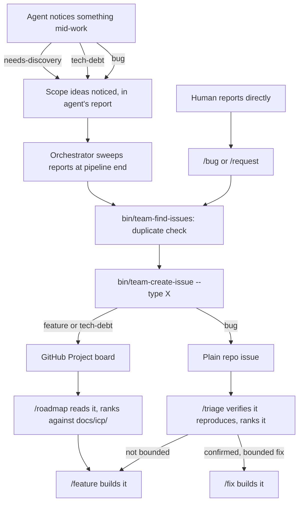

# Backlog & Triage

Two parallel queues, both living on GitHub instead of a local file: one for things worth building, one for things that are broken. This doc covers how an idea gets from "someone noticed it" to "ranked and ready to work on."

## What It Is

Think of it as two different front desks in the same building. A GitHub Project board is the front desk for "should we build this" — features and tech debt, ranked against who the product is actually for. The plain Issues tab is the front desk for "is this actually broken" — bugs, verified against the real code before anyone trusts them. Nothing that reaches one desk automatically reaches the other; a `bug`-labeled issue never gets a card on the board, and a `feature`/`tech-debt` issue is never mixed into the bug queue.

## How It Works

## Where Ideas Come From

**Any pipeline agent, mid-work.** Discovery, architect, design, engineer, and all four reviewers can notice something adjacent to what they're actually doing — a missing capability, tech debt, or an unrelated bug — and name it in their own report under a **Scope ideas noticed** entry, tagged `needs-discovery`, `tech-debt`, or `bug` (see the `scope-capture` skill). They never file anything themselves — most are restricted to their feature directory, and four of them run in parallel, so a coordinated duplicate-check needs one filer, not four racing `gh` calls. The orchestrator is that one filer: once a `/feature` or `/fix` run reaches a final verdict, it sweeps every report and files each survivor.

**A human, directly.** `/bug` and `/request` interview a reporter, search the codebase for supporting context, and file the same way — same labels, same destinations, same duplicate-check, just with a human confirming live instead of the orchestrator confirming against existing issues.

## The Filing Tools

Every filer — the orchestrator, `/bug`, `/request`, and `bug-triage`'s reclassify case — goes through the same two scripts instead of constructing `gh` calls independently:

- **`bin/team-find-issues`** — a duplicate-check. Returns candidates; never decides whether one's a real match. `matches: []` is a normal, successful result, not a failure.
- **`bin/team-create-issue`** — the routing is fixed inside the script, not exposed as a flag. A `bug` cannot reach the project board through this tool no matter what's passed; a `feature`/`tech-debt` cannot skip it. If the project isn't configured yet in `team.yml`, it fails *before* creating anything, rather than filing an issue that silently misses the board.

See the `github-cli` skill for the full command reference.

## Ranking: `/roadmap` and `/triage`

**`/roadmap`** reads every open `feature`- and `tech-debt`-labeled issue, plus every persona file under `docs/icp/`, and proposes a build order on two independent axes: dependency (does this need something that doesn't exist yet) and value (does this serve a persona `docs/icp/` describes). It's a reviewer — it never modifies an existing issue, and it never builds anything. When it surfaces a genuinely new gap itself, it asks before filing.

**`/triage`** is the harder-verification counterpart for bugs. It reproduces or confirms each open bug against the actual code before trusting it — "cannot reproduce" is a valid, closing verdict, not a failure to find something — then ranks by severity and whether the broken flow is one a persona actually uses. It recommends one of four routes: a direct fix (run `/fix {number}`), escalation to `/feature` when the fix isn't actually bounded, closing as cannot-reproduce or already-fixed, or reclassifying as a feature request when the "bug" turns out to need a new decision rather than a restored one.

Both write a report — `docs/roadmap.md` and `docs/triage.md` — refreshed in place on each run rather than dated per run, so both live at a stable path with git history doing the job a filename date would otherwise do.

## `TODO.md`'s Narrower Job

`TODO.md` still exists, but only for **Deferred** entries — a decision deliberately set aside during one specific in-flight build, with the reasoning and options considered, so the next session doesn't re-litigate it. That's a fundamentally different thing from a backlog candidate: a deferred decision is tied to one past build, not something `/roadmap` would ever rank. Needs Discovery and Tech Debt, the two sections that used to live here, retired once GitHub became the destination — see `commands/init-project.md`'s TODO.md section for the exact convention.

## Things to Know

- The three labels — `feature`, `bug`, `tech-debt` — are created by `/install` (see `docs/installer.md`). Filing fails clearly if a label is missing rather than silently creating one mid-file.
- A `bug` that turns out to need a real decision (not "restore what used to work," but "decide what the right behavior even is") gets reclassified by `bug-triage`, with the user's confirmation — filed as a `feature`, referencing the original bug number. `roadmap-analyst` does the reverse case: a `TODO.md`-era or backlog "feature" idea that's really a bug, though in the current design that mostly surfaces as a judgment call during a roadmap pass, not a dedicated step.
- Nothing in this whole system auto-triggers a build. `/roadmap` and `/triage` propose an order and a route; a human (or a later `/feature`/`/fix` invocation) decides what actually gets scheduled.
