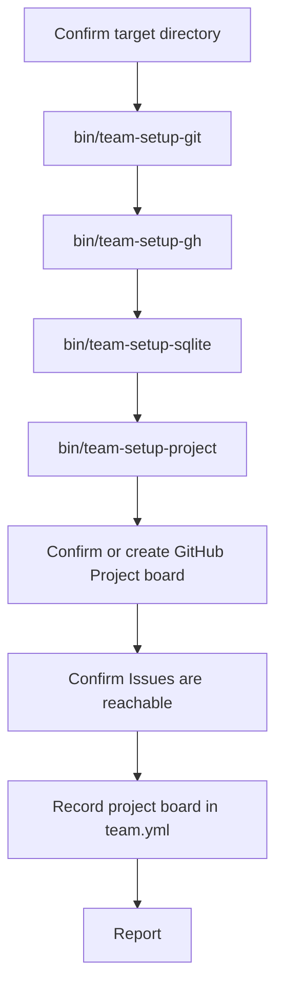

# Installer

`/install` prepares a fresh repo for this team. It's the first thing a stranger runs, and the only command in this team designed to be safe to run repeatedly without thinking about it first.

## What It Is

Think of it as a building inspector walking a new site before anyone moves in: check each item with a real test, in order, and don't let the next step start on a foundation that isn't actually confirmed. The agent itself barely does any of the checking — four small scripts do the actual OS-level and filesystem work, and the agent's job is just to run them, read back a JSON status, and decide what a human needs to do about anything that isn't `ok`.

## How It Works



Steps A, F, G, and H are conversational — the agent asks something and waits. Steps B through E are pure script calls; the agent reads one JSON object off the last line of each script's output and branches on its `status` field (`ok`, `needs_input`, `needs_confirmation`, `manual`, or `failed`).

## The Four Scripts

| Script | Installs | Why it can't always run silently |
|---|---|---|
| `bin/team-setup-git` | `git` | No clean "static binary, no sudo" path exists for git — every real install route needs either sudo (Linux) or a GUI installer (macOS Xcode tools) |
| `bin/team-setup-gh` | `gh`, then authenticates it | Installing `gh` itself is safe to automate (a user-owned binary download on Linux, Homebrew on macOS); `gh auth login` is unavoidably a human's browser or device-code flow |
| `bin/team-setup-sqlite` | `sqlite3` | Same reasoning as git — `bin/agent-log` shells out to this binary directly for every read and write |
| `bin/team-setup-project` | `team.yml`, the `feature`/`bug`/`tech-debt` repo labels, `db/agent_log.sqlite3`, the `docs/` skeleton | All of this is genuinely safe to do without asking — no system-level install, just files inside the target repo |

`team-setup-git`, `team-setup-gh`, and `team-setup-sqlite` share the same pattern: when installing needs sudo or a GUI flow, the script opens a terminal window with the exact command already typed in, and reports `needs_confirmation` — it never runs a system-modifying install itself unless that install is provably safe (Homebrew on macOS, a user-owned prefix). The agent asks the user to finish in that window, then re-runs the script to confirm before moving on.

## `team.yml`

The one piece of config every GitHub-facing agent in this team reads — repo, project board, labels, and two tunable numbers:

```yaml
github:
  repo: owner/repo
  project:
    owner: owner-or-org
    number: 4
  default_status: Ready
  labels:
    feature: feature
    bug: bug
    tech-debt: tech-debt

review:
  escalation_rounds: 3

cadence:
  log_analyst_interval: 15
```

`bin/team-setup-project` writes `github.repo` with a comment-preserving targeted edit, never a full-file rewrite — the file stays safe to hand-edit, which the file's own header comment says explicitly. `github.project.owner`/`number` are filled in later, by the installer agent itself after the human confirms which board to use, using the same targeted-edit approach.

## Idempotency

A second run isn't a no-op — it re-verifies everything live (GitHub state can drift even when `team.yml` hasn't) and reports it all as already present rather than re-asking the same questions. This is why the scripts print structured status instead of just doing work silently: "already correct" and "just fixed" both look like `status: "ok"` to the agent, but the `detail` string says which.

## Things to Know

- What's still manual, permanently: copying `bin/agent-log` itself into a target repo that doesn't already have it (no script vendors it in yet), and `ruby` being on `PATH` (never auto-installed).
- Adding a *new option* to a GitHub Project board's existing Status field (e.g. "Ready" on a board that only ships with Todo/In Progress/Done) has no clean `gh` command — `gh project field-create` can make a whole new field, but there's no `field-edit` to add an option to one that already exists. This is a permanent ceiling in what `gh` exposes, not a "not yet built" gap — see `agents/installer.md`'s "Won't Be Built This Way." The installer checks for it and asks the user to add it in the GitHub UI rather than attempting an undocumented GraphQL mutation.
- Every script's output is one JSON object on the last line of stdout — everything before that line is human-readable progress noise, safe for the agent to ignore programmatically.
- None of the four scripts touch application code. The only files they ever write are `team.yml`, repo labels, `db/agent_log.sqlite3`, and the `docs/` skeleton directories.
