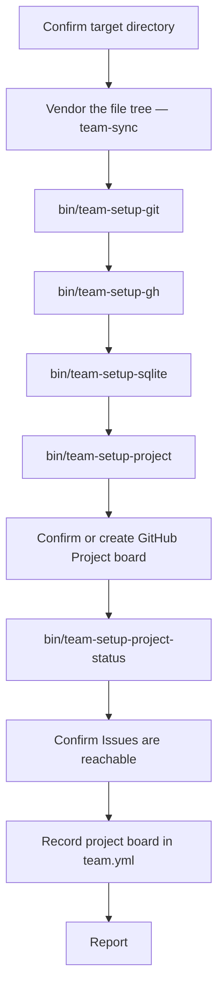

# Installer

`/install` prepares a fresh repo for this team. It's the first thing a stranger runs, and the only command in this team designed to be safe to run repeatedly without thinking about it first.

## What It Is

Think of it as a building inspector walking a new site before anyone moves in: check each item with a real test, in order, and don't let the next step start on a foundation that isn't actually confirmed. The agent itself barely does any of the checking — one shared sync procedure (the `team-sync` skill) vendors the file tree, and five small scripts do the rest of the OS-level, filesystem, and GitHub-API work; the agent's job is just to run them, read back a JSON status, and decide what a human needs to do about anything that isn't `ok`.

## How It Works



Steps A, F, G, and H are conversational — the agent asks something and waits. A2 is the `team-sync` skill's plan/apply cycle (see [Updates](updates.md)) — conversational only if something needs a decision (a conflict, a removed file); on a fresh repo it's almost always "vendor everything, no decisions needed." Steps B through E and F2 are pure script calls; the agent reads one JSON object off the last line of each script's output and branches on its `status` field (`ok`, `needs_input`, `needs_confirmation`, `manual`, or `failed`).

## Vendoring the File Tree (Step 0.5)

Before any of the five scripts below can run, they have to actually exist in the target repo — on a truly fresh install, they don't yet. `/install` closes that gap itself now: it resolves the source repo (`team.yml`'s `team.source_repo`, or a hardcoded default), gets a runnable copy of `bin/team-update` (shallow-cloning the source repo into a scratch directory if the target doesn't have one yet — it almost never does on a first install), and runs the same plan/apply cycle `/update` uses going forward. See [Updates](updates.md) for the full mechanism; the only thing specific to `/install` is that it may need to bootstrap a temporary copy of `bin/team-update` to run this the very first time.

The one thing this can't automate away: `commands/install.md` and `agents/installer.md` themselves have to already exist in the target repo before Claude Code can even offer `/install` as a slash command. That's the one irreducible manual seed — everything else, including every `bin/` script below, now vendors itself.

## The Five Scripts

| Script | Does | Why it can't always run silently |
|---|---|---|
| `bin/team-setup-git` | Installs `git` | No clean "static binary, no sudo" path exists for git — every real install route needs either sudo (Linux) or a GUI installer (macOS Xcode tools) |
| `bin/team-setup-gh` | Installs `gh`, then authenticates it | Installing `gh` itself is safe to automate (a user-owned binary download on Linux, Homebrew on macOS); `gh auth login` is unavoidably a human's browser or device-code flow |
| `bin/team-setup-sqlite` | Installs `sqlite3` | Same reasoning as git — `bin/agent-log` shells out to this binary directly for every read and write |
| `bin/team-setup-project` | Writes `team.yml`, the `feature`/`bug`/`tech-debt` repo labels, `db/agent_log.sqlite3`, the `docs/` skeleton | All of this is genuinely safe to do without asking — no system-level install, just files inside the target repo |
| `bin/team-setup-project-status` | Adds a missing option to the Project board's Status field | Not something that needs asking either — see "Status Field Options" below for why this one used a GraphQL mutation instead of a normal `gh project` command |

`team-setup-git`, `team-setup-gh`, and `team-setup-sqlite` share the same pattern: when installing needs sudo or a GUI flow, the script opens a terminal window with the exact command already typed in, and reports `needs_confirmation` — it never runs a system-modifying install itself unless that install is provably safe (Homebrew on macOS, a user-owned prefix). The agent asks the user to finish in that window, then re-runs the script to confirm before moving on.

## Status Field Options

Adding a *new option* to a GitHub Project board's existing Status field (e.g. "Ready" on a board that only ships with Todo/In Progress/Done) has no dedicated `gh` command — `gh project field-create` can make a brand-new field, but nothing edits an option onto one that already exists. `bin/team-setup-project-status` does it through the underlying GraphQL API instead: `updateProjectV2Field` requires resending the field's entire option list on every call, so the script always reads every existing option's id, name, color, and description first (`gh project field-list` doesn't expose color/description, so this is a separate query), then resends that full list plus the one new option. Leaving any existing option out of that list would silently delete it — and any card already set to it — so the script never constructs the list from anything but a fresh read. This was verified against a real, item-free project board before being trusted in the installer.

## `team.yml`

The one piece of config every GitHub-facing agent in this team reads — repo, project board, labels, and two tunable numbers:

```yaml
github:
  repo: owner/repo
  project:
    owner: owner-or-org
    number: 4
  default_status: Ready
  labels:
    feature: feature
    bug: bug
    tech-debt: tech-debt

review:
  escalation_rounds: 3

cadence:
  log_analyst_interval: 15
```

`bin/team-setup-project` writes `github.repo` with a comment-preserving targeted edit, never a full-file rewrite — the file stays safe to hand-edit, which the file's own header comment says explicitly. `github.project.owner`/`number` are filled in later, by the installer agent itself after the human confirms which board to use, using the same targeted-edit approach.

## Idempotency

A second run isn't a no-op — it re-verifies everything live (GitHub state can drift even when `team.yml` hasn't) and reports it all as already present rather than re-asking the same questions. This is why the scripts print structured status instead of just doing work silently: "already correct" and "just fixed" both look like `status: "ok"` to the agent, but the `detail` string says which.

## Things to Know

- What's still manual, permanently: `commands/install.md` and `agents/installer.md` (and enough of `bin/team-update` — or the `team-sync` skill's bootstrap-clone path — to make `/install` invocable at all) have to exist before `/install` can run for the first time; and `ruby` being on `PATH` (never auto-installed).
- Every script's output is one JSON object on the last line of stdout — everything before that line is human-readable progress noise, safe for the agent to ignore programmatically.
- None of the five scripts touch application code. The only things they ever write are `team.yml`, repo labels, `db/agent_log.sqlite3`, the `docs/` skeleton directories, and (`team-setup-project-status` only) an option on the Project board's own Status field.
