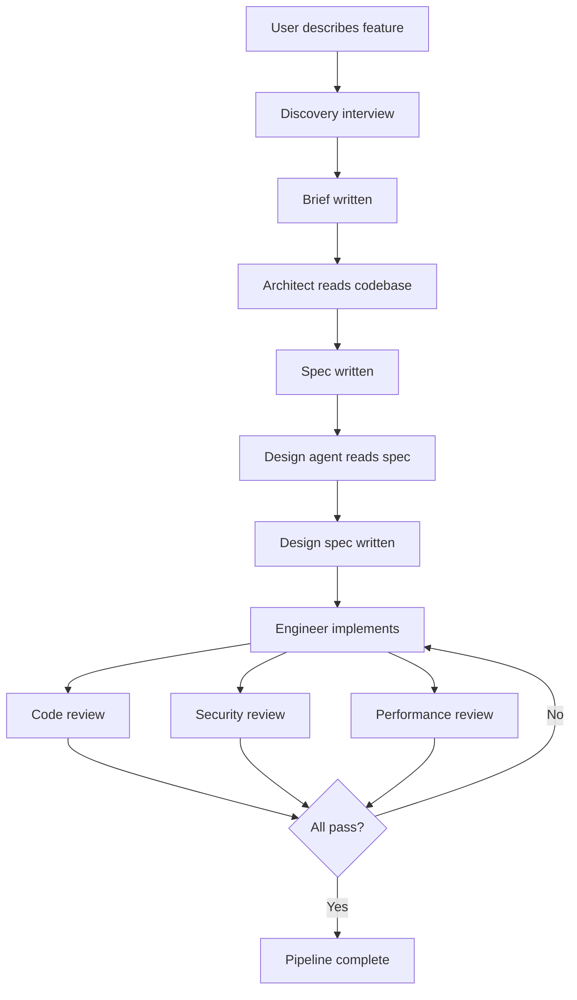

# Pipeline

A feature moves through nine stages in a fixed sequence. Each stage writes an artifact file. The next stage cannot start until that file exists.

## What It Is

Think of the pipeline like an assembly line. Each station has one job and one output. The discovery station writes a requirements brief. The architect station reads that brief and writes a technical spec. The design station reads the spec and writes a UI design. The engineer station builds the feature. Three review stations check the work in parallel. If any reviewer flags a blocking issue, the feature goes back to engineering and the cycle repeats.

Nothing advances until the previous artifact exists. The orchestrator detects which artifacts are present and re-enters from the first missing stage automatically.

## How It Works

Here is how a feature moves from idea to passing review:



All three review agents run in parallel. The engineer reruns only after all three complete.

## Artifact Naming

Every feature gets a number and a directory under `docs/briefs/`. All artifacts for that feature live in that directory, named by stage and round:

```
docs/briefs/001-feature-name/
  001.01-dis-feature-name.md   ← discovery brief
  001.02-arc-feature-name.md   ← architect spec
  001.03-des-feature-name.md   ← design spec
  001.04-eng-feature-name.md   ← engineer report, round 1
  001.05-cr-feature-name.md    ← code review, round 1
  001.06-sec-feature-name.md   ← security review, round 1
  001.07-perf-feature-name.md  ← performance review, round 1
  001.08-eng-feature-name.md   ← engineer report, round 2
  ...
```

Sequence numbers increase monotonically. Prior-round files are never deleted. The full review history for a feature is always visible by listing the feature directory.

## Example

Start a new feature:

```
/feature Add a dashboard showing sync status for all customer listings
```

Claude assigns the next feature number, interviews you to produce a brief, then hands the brief to the architect. The architect reads your codebase before writing the spec. From there the pipeline continues automatically.

## Things to Know

- The discovery stage runs in the main conversation, not as a subagent. It needs to talk to you interactively.
- Resume any in-progress pipeline by feature number: `/feature resume 001`
- Skip discovery if you already have a brief: `/feature architect path/to/brief.md`
- If the same review category fails in two consecutive rounds, the orchestrator names it explicitly rather than silently re-routing.
- If a category fails three rounds in a row, the orchestrator escalates to you. Three rounds of the same problem is a signal the spec or the agent skill is wrong, not the engineer.
- After a pipeline completes, the engineer and architect each record what actually happened against their earlier expected outcomes. Those records feed the learning loop.
