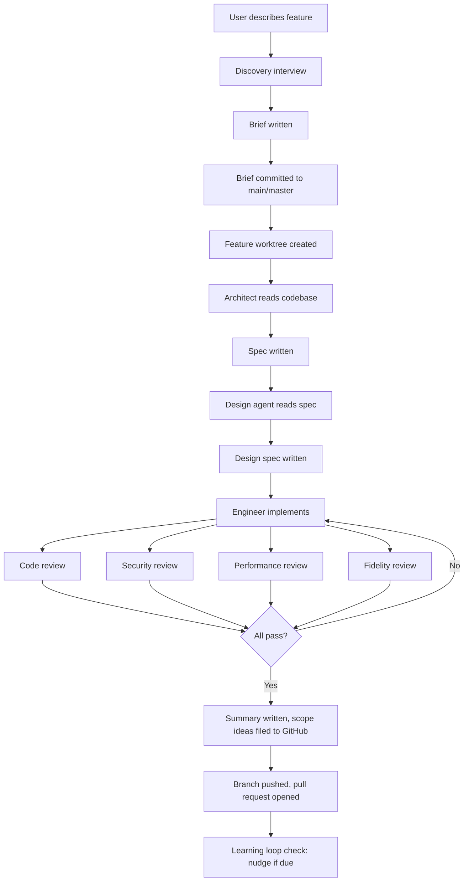
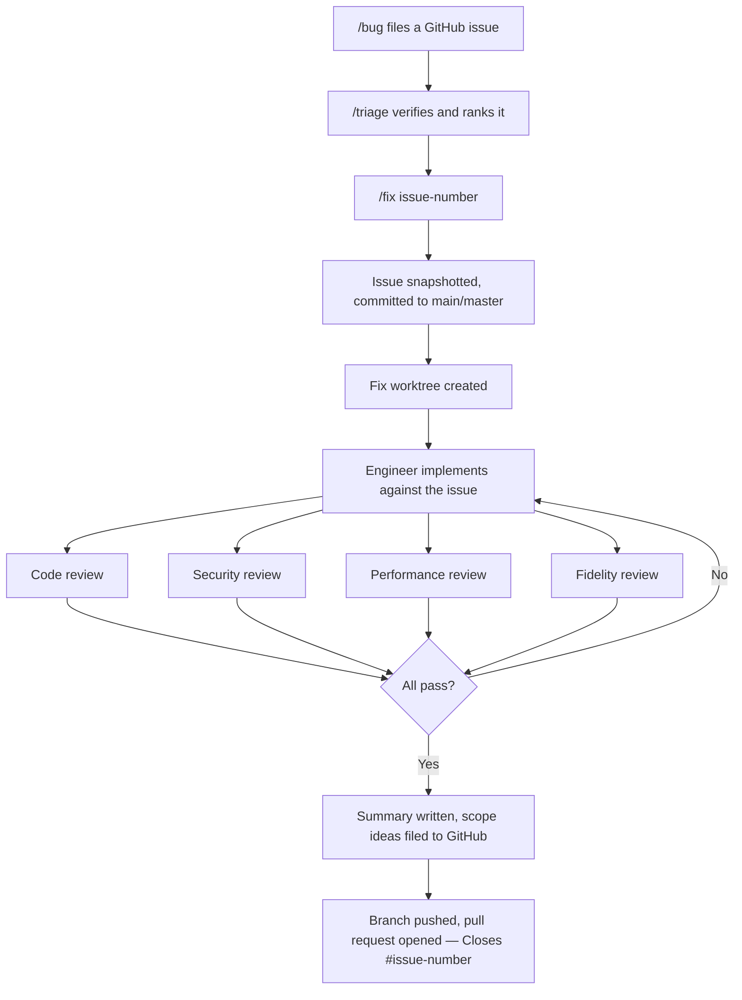

# Pipeline

A feature moves through eleven stages in a fixed sequence. Most write an artifact file, and the next stage can't start until that file exists — a few near the end act on the accumulated result instead (opening the pull request, checking whether the learning loop needs attention) rather than producing a new one.

## What It Is

Think of the pipeline like an assembly line. Each station has one job and one output. The discovery station writes a requirements brief. The architect station reads that brief and writes a technical spec. The design station reads the spec and writes a UI design. The engineer station builds the feature. Four review stations check the work in parallel — three check the code itself (quality, security, performance); the fourth checks the whole chain, whether the code still matches the plan and the plan still solves the original problem. If any reviewer flags a blocking issue, the feature goes back to engineering and the cycle repeats.

Nothing advances until the previous artifact exists. The orchestrator detects which artifacts are present and re-enters from the first missing stage automatically.

The discovery brief is the one artifact that lands directly on `main`/`master`. Everything after it — spec, design, code, review reports — happens in a dedicated git worktree on its own feature branch, so no other work in the main checkout gets disturbed while the pipeline runs. When the pipeline reaches a final verdict, the orchestrator pushes that branch and opens a pull request; it never merges one itself.

## How It Works

Here is how a feature moves from idea to an open pull request:


```mermaid
flowchart TD
    A[User describes feature] --> B[Discovery interview]
    B --> C[Brief written]
    C --> C2[Brief committed to main/master]
    C2 --> C3[Feature worktree created]
    C3 --> D[Architect reads codebase]
    D --> E[Spec written]
    E --> F[Design agent reads spec]
    F --> G[Design spec written]
    G --> H[Engineer implements]
    H --> I[Code review]
    H --> J[Security review]
    H --> K[Performance review]
    H --> N[Fidelity review]
    I --> L{All pass?}
    J --> L
    K --> L
    N --> L
    L -->|Yes| M[Summary written, scope ideas filed to GitHub]
    M --> P[Branch pushed, pull request opened]
    P --> Q[Learning loop check: nudge if due]
    L -->|No| H
```

All four review agents run in parallel. The engineer reruns only after all four complete.

## Artifact Naming

Every feature gets a number and a directory under `docs/briefs/`. All artifacts for that feature live in that directory, named by stage and round:

```
docs/briefs/001-feature-name/
  001.01-dis-feature-name.md   ← discovery brief
  001.02-arc-feature-name.md   ← architect spec
  001.03-des-feature-name.md   ← design spec
  001.04-eng-feature-name.md   ← engineer report, round 1
  001.05-cr-feature-name.md    ← code review, round 1
  001.06-sec-feature-name.md   ← security review, round 1
  001.07-perf-feature-name.md  ← performance review, round 1
  001.08-fid-feature-name.md   ← fidelity review, round 1
  001.09-eng-feature-name.md   ← engineer report, round 2
  ...
```

Sequence numbers increase monotonically. Prior-round files are never deleted. The full review history for a feature is always visible by listing the feature directory.

## Example

Start a new feature:

```
/feature Add a dashboard showing sync status for all customer listings
```

Claude assigns the next feature number, interviews you to produce a brief, then hands the brief to the architect. The architect reads your codebase before writing the spec. From there the pipeline continues automatically.

## Bug Fix Path

A bug fix is the same assembly line with the first three stations removed. `/bug` already interviewed the reporter and filed a GitHub issue; `bug-triage` (`/triage`) already verified it reproduces and confirmed it's worth fixing now. By the time a bug reaches `/fix {issue-number}`, there's nothing left to discover, architect, or design — the issue itself is the full scope, so the orchestrator's Bug Fix Mode skips straight to the engineer and runs the same four parallel reviewers and verdict gate the feature pipeline uses.


```mermaid
flowchart TD
    A["/bug files a GitHub issue"] --> B["/triage verifies and ranks it"]
    B --> C["/fix issue-number"]
    C --> D[Issue snapshotted, committed to main/master]
    D --> E[Fix worktree created]
    E --> F[Engineer implements against the issue]
    F --> G[Code review]
    F --> H[Security review]
    F --> I[Performance review]
    F --> J[Fidelity review]
    G --> K{All pass?}
    H --> K
    I --> K
    J --> K
    K -->|Yes| L[Summary written, scope ideas filed to GitHub]
    L --> M[Branch pushed, pull request opened — Closes #issue-number]
    K -->|No| F
```

Artifacts live at `docs/bugfixes/{N}-{slug}/`, numbered from `{N}.00-issue-{slug}.md` (the issue snapshot, standing in for both the discovery brief and the architect spec) through the same `-eng-`/`-cr-`/`-sec-`/`-perf-`/`-fid-` sequence the feature pipeline uses. Round tracking, the three-strikes escalation rule, and the never-self-merge rule all apply exactly as they do to a feature — see the orchestrator's "Bug Fix Mode" section for the stage-by-stage detail.

## Things to Know

- The discovery stage runs in the main conversation, not as a subagent. It needs to talk to you interactively.
- Every artifact this pipeline produces gets committed on the feature branch right after the stage that wrote it confirms the file exists — the spec after Stage 2, the design spec after Stage 3, the engineer's report after Stage 4 (the engineer's own code is committed separately, incrementally, per its TDD workflow), the four review reports as one commit after Stage 5, the summary after Stage 7. Nothing is left uncommitted and batched up for the very end — watch the worktree's `git log` and you'll see the pipeline's actual progress, not just its final state.
- Resume any in-progress pipeline by feature number: `/feature resume 001`
- Skip discovery if you already have a brief: `/feature architect path/to/brief.md`
- If the same review category fails in two consecutive rounds, the orchestrator names it explicitly rather than silently re-routing.
- If a category fails the same finding for `review.escalation_rounds` rounds in a row (`team.yml`; 3 by default), the orchestrator escalates to you rather than routing back to the engineer again. That many rounds of the same problem is a signal the spec or the agent skill is wrong, not the engineer.
- After a pipeline completes, the engineer and architect each record what actually happened against their earlier expected outcomes. Those records feed the learning loop.
- As the very last step, the orchestrator checks how many completed cycles — feature or bug fix — have piled up since `log-analyst` last ran and mentions it in the final report once that reaches the configured threshold (`cadence.log_analyst_interval` in `team.yml`; 15 by default) — it never runs `log-analyst` for you, only tells you when it's worth doing yourself.
- Any agent can notice something that should exist but isn't part of the current feature — a missing capability, tech debt, or an unrelated bug. Rather than build it or let it evaporate, it names the idea in its own report, tagged `needs-discovery`, `tech-debt`, or `bug`; at pipeline completion the orchestrator sweeps every report and files each survivor (after a duplicate check) as a labeled GitHub issue — `feature` or `tech-debt` onto the project board, `bug` as a plain repo issue. See the `scope-capture` skill. `/roadmap` later reads open `feature`/`tech-debt` issues against every persona file under `docs/icp/` and the codebase to propose a build order; `/triage` does the same for `bug` issues.
- The feature branch and its worktree stay around after the pull request opens — they're still needed if review comments come back. Remove the worktree yourself (`git worktree remove ../{NNN}-{feature-name}`) once the PR is actually merged; the orchestrator won't do it automatically.
- `db/agent_log.sqlite3` is shared across every worktree — every agent launch is told to `export AGENT_LOG_DB` pointing back at the main checkout's copy, so decisions logged mid-feature don't end up scattered across per-worktree databases nobody reads.
