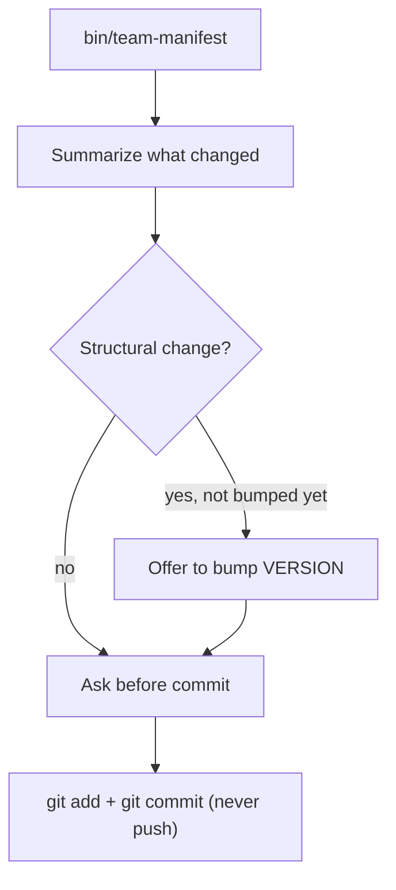
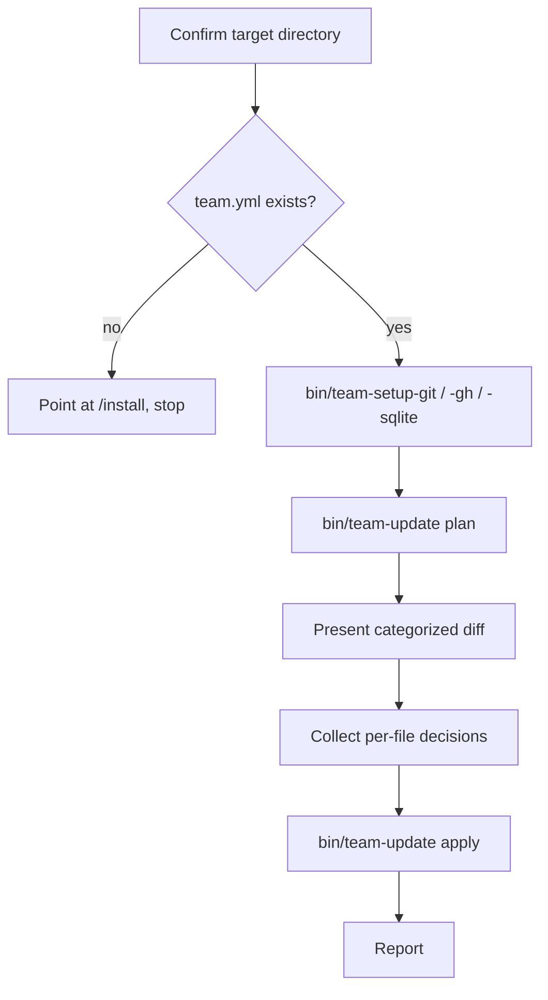

# Updates

`/deploy` and `/update` are the two halves of one mechanism: keeping every repo that vendored a copy of this team's `agents/`, `commands/`, `skills/`, and `bin/` files in sync with this source repo, without a human hand-copying files or writing a one-off upgrade doc each time something changes.

## What This Replaces

Before this existed, getting a change from this repo into an installed target repo meant writing a `docs/portable-upgrades/*.md` instruction document by hand and having an agent apply it file by file — no automated way to tell which files had actually diverged, and no automated way to vendor in a file that was never copied over in the first place (the installer's long-standing "install `bin/agent-log` itself" gap). Those historical documents stay as records of what they did; nothing about them changes. Going forward, a change that needs to reach installed repos goes out via `/deploy` + `/update` instead.

## `/deploy` — Source Repo Side

Run in *this* repo only — it's a maintainer tool, not one of the team's agents, and an installed target repo never runs it.



`bin/team-manifest` hashes every tracked file (see "Tracked Files" below) with SHA-256 and writes `manifest.yml` at the repo root:

```yaml
version: 1.12.0
generated_at: 2026-09-16T00:00:00Z
source_repo: https://github.com/revans/rails-agentic-engineering-team.git
files:
  agents/architect.md: 3f2a9c...
  bin/agent-log: 91be0d...
  commands/bug.md: 7ac412...
  skills/agent-log/SKILL.md: c04eaa...
  # ...every tracked file, sorted by path
```

`manifest.yml` is generated — don't hand-edit it, `/deploy` regenerates it wholesale every run. `version` comes from the `VERSION` file, not bumped automatically; this repo's own history (`git log -p -- VERSION`) shows bumps ride along with the commit that makes a structural change, so `/deploy` only offers to bump it, never does so on its own. `/deploy` also never commits or pushes without asking first, same as every other action in this repo that touches shared state.

## `/update` — Target Repo Side

Run in an already-installed target repo, on demand — after a `/deploy`, or just periodically.



Steps A and E–F are conversational — the updater agent asks and waits. C is the same three scripts `/install` uses, same JSON-status branching. D and G are script calls read as one JSON object off the last line of output.

### Tracked Files

`agents/**`, `commands/**`, `skills/**`, `bin/*` — everything this team vendors into a target repo except `bin/team-manifest` itself, which only exists in the source repo. `docs/`, `README.md`, and `VERSION` aren't tracked as files; `VERSION`'s value travels as `manifest.yml`'s top-level `version` field instead, since a target repo's own `docs/` holds project-specific content (briefs, ICP personas, bug triage) that has nothing to do with the source repo's copy.

### `team.lock.yml`

Generated by `bin/team-update`, lives next to `team.yml` in the target repo — don't hand-edit it. It records the hash each tracked file had immediately after the *last successful sync*, which is what makes a three-way comparison possible: without it, `/update` could only see "local differs from upstream," never *why*.

```yaml
source_repo: https://github.com/revans/rails-agentic-engineering-team.git
synced_version: 1.12.0
synced_at: 2026-09-16T00:00:00Z
files:
  agents/architect.md: 3f2a9c...
  # ...every file synced at least once
```

A target repo can point at a different source repo by setting `team.source_repo` in its own `team.yml` (optional — falls back to this repo's own URL if unset). `bin/team-update` also accepts `--source-repo` directly, for testing against a local clone.

### How a File Gets Classified

For every file in the source repo's manifest, `bin/team-update plan` compares three values — the file's hash as of the last sync (`base`, from `team.lock.yml`), its current local hash (`local`), and its current upstream hash (`remote`):

| Situation | Category | What happens |
|---|---|---|
| File doesn't exist locally at all | **New file** | Vendor it in — no local content to lose |
| `local` matches `remote` | **Clean** (counted, not listed, unless `base` is also stale) | Nothing to do — already in sync |
| No sync history (`base` unknown) and `local` ≠ `remote` | **Conflict** | Can't tell a hand-edit from a stale copy — ask |
| `local` == `base`, `remote` ≠ `base` | **Clean update** | Upstream changed it, nothing local touched it — safe to auto-apply |
| `local` ≠ `base`, `remote` == `base` | **Local-only edit** | Hand-edited here, upstream hasn't moved — report only, no action |
| `local` ≠ `base`, `remote` ≠ `base`, `local` ≠ `remote` | **Conflict** | Both sides changed since the last sync — show a diff, ask: take upstream, keep local, or skip |
| Tracked before (`team.lock.yml` has it), gone from the manifest now | **Removed upstream** | Ask: delete locally too, or keep it |

A file on disk that appears in neither the manifest nor `team.lock.yml` is never touched or reported — that's the target repo's own project-specific addition, not this tool's concern. Resolving a conflict as "keep local" updates `team.lock.yml`'s recorded hash to the current upstream value, which means it stops being flagged — it will correctly surface as a conflict again only if upstream changes that file further while the local version still differs.

### Snapshot Reuse

`plan` shallow-clones the source repo into a temp directory once and prints its path (`snapshot_dir`) in its JSON output; `apply` reads from that same directory instead of re-cloning, so a plan-then-apply pair only ever touches the network once. If the user backs out after seeing the plan without applying anything, `bin/team-update cleanup --snapshot-dir SNAP` removes the temp clone.

## Things to Know

- `/deploy` never bumps `VERSION` on its own — it's a deliberate, per-change human/agent decision, not a mechanical part of every deploy.
- `/update` assumes `/install` has already run (`team.yml` must exist) — it doesn't bootstrap GitHub or system-level setup itself, only re-verifies the three dependencies `/install` already checks.
- `apply` always seeds `team.lock.yml` with a baseline hash for every file that already matches upstream, even ones nobody had to decide anything about — a file with no recorded baseline reads as an unexplained conflict the next time either side touches it, so `apply` runs every time `plan` does, even when nothing needed a decision.
- Neither script ever pushes to a remote or force-overwrites a file `/update` can't classify with confidence — a conflict always gets a human answer.
