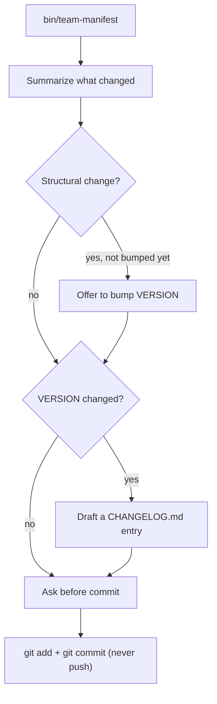
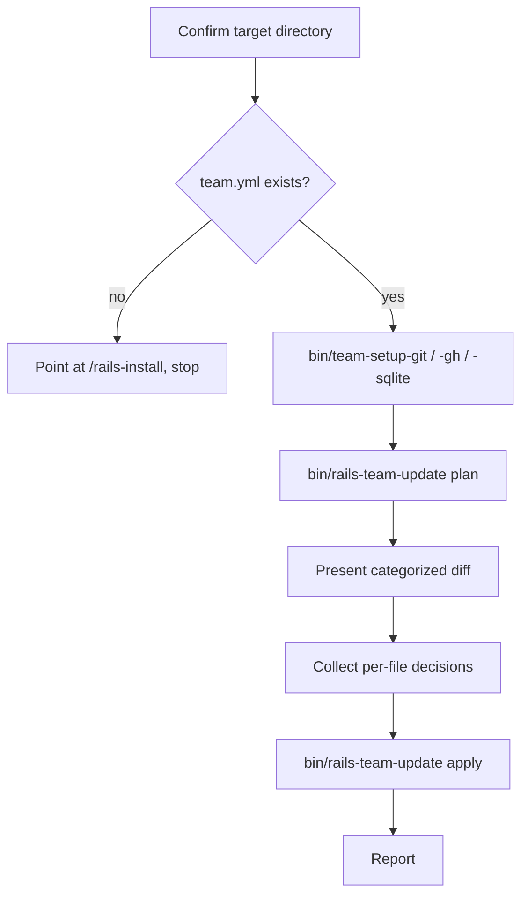

# Updates

`/rails-deploy` and `/rails-update` (plus `/rails-install`, which now uses the same mechanism for its very first vendor) are the halves of one system: keeping every repo that has a copy of this team's `agents/`, `commands/`, `skills/`, and `bin/` files in sync with this source repo, without a human hand-copying files or writing a one-off upgrade doc each time something changes. The actual plan/apply procedure — what to run, what to ask about — lives in one place, the `team-sync` skill, so `agents/rails-installer.md` and `agents/rails-updater.md` both reference it instead of each restating it.

## What This Replaces

Before this existed, getting a change from this repo into an installed target repo meant writing a `docs/portable-upgrades/*.md` instruction document by hand and having an agent apply it file by file — no automated way to tell which files had actually diverged, and no automated way to vendor in a file that was never copied over in the first place. Getting the files there in the *first* place was manual too: `/rails-install` never vendored anything, it only assumed `bin/agent-log` and the rest of the tree were already sitting in the repo. Those historical upgrade documents stay as records of what they did; nothing about them changes. Going forward, a change that needs to reach installed repos goes out via `/rails-deploy` + `/rails-update`, and a repo that's never seen this team before gets everything from `/rails-install`'s own first sync.

## `/rails-deploy` — Source Repo Side

Run in *this* repo only — it's a maintainer tool, not one of the team's agents, and an installed target repo never runs it.



`bin/team-manifest` hashes every tracked file (see "Tracked Files" below) with SHA-256 and writes `manifest.yml` at the repo root:

```yaml
version: 1.12.0
generated_at: 2026-09-16T00:00:00Z
source_repo: https://github.com/revans/rails-agentic-engineering-team.git
files:
  agents/architect.md: 3f2a9c...
  bin/agent-log: 91be0d...
  commands/bug.md: 7ac412...
  skills/agent-log/SKILL.md: c04eaa...
  # ...every tracked file, sorted by path
```

`manifest.yml` is generated — don't hand-edit it, `/rails-deploy` regenerates it wholesale every run. `version` comes from the `VERSION` file, not bumped automatically; this repo's own history (`git log -p -- VERSION`) shows bumps ride along with the commit that makes a structural change, so `/rails-deploy` only offers to bump it, never does so on its own.

When `VERSION` did change, `/rails-deploy` also drafts and asks about adding a `CHANGELOG.md` entry — human-readable release notes for this project itself (newest first, one entry per version), distinct from `docs/updates-log.md` (below), which is a mechanical per-file record generated in each *target* repo, not this one. `/rails-deploy` also never commits or pushes without asking first, same as every other action in this repo that touches shared state.

## `/rails-install` — First Vendor

`/rails-install`'s Step 0.5 runs the exact same plan/apply cycle the `team-sync` skill describes and `/rails-update` uses below (see "How a File Gets Classified" and "Snapshot Reuse"), with one difference: the target repo almost certainly has no `bin/rails-team-update` yet to run, since nothing has ever been vendored there. To get around that, it shallow-clones the source repo into a scratch directory purely to obtain a runnable copy of the script, then invokes `ruby {scratch}/bin/rails-team-update ...` in place of `bin/rails-team-update ...` — the script never assumes it's running from inside the directory it's operating on, every path is passed explicitly via `--dir`/`--snapshot-dir`, so this works identically. That scratch directory is separate from (and removed independently of) the snapshot directory `plan` itself creates for the actual file diffing.

On a truly fresh repo this makes almost every tracked file a `new_file` — expected, not a conflict, since there's nothing local to lose. A *second* run of `/rails-install` against an already-vendored repo goes through the identical procedure and simply finds the normal mix of clean updates, conflicts, and unchanged files `/rails-update` would also find; `/rails-install` isn't a separate, weaker sync path, it's the same one, just possibly starting from nothing.

The one thing that can't be automated away: `commands/rails-install.md` and `agents/rails-installer.md` themselves have to exist in the target repo before Claude Code can offer `/rails-install` as a slash command at all — no in-repo mechanism can vendor the file that makes vendoring possible. Everything past that point, including every `bin/` script `/rails-install`'s later steps depend on, is now self-vendoring.

## `/rails-update` — Target Repo Side

Run in an already-installed target repo, on demand — after a `/rails-deploy`, or just periodically.



Steps A and E–F are conversational — the updater agent asks and waits. C is the same three scripts `/rails-install` uses, same JSON-status branching. D and G are script calls read as one JSON object off the last line of output.

### Tracked Files

`agents/**`, `commands/**`, `skills/**`, `bin/*` — everything this team vendors into a target repo except two files that only make sense in *this* repo: `bin/team-manifest` (the build tool that produces `manifest.yml` — a target repo never needs to produce one) and `commands/rails-deploy.md` (`/rails-deploy` reads `bin/team-manifest`, so a `/rails-deploy` command vendored into a target repo without that script would just be dead). `docs/`, `README.md`, and `VERSION` aren't tracked as files either; `VERSION`'s value travels as `manifest.yml`'s top-level `version` field instead, since a target repo's own `docs/` holds project-specific content (briefs, ICP personas, bug triage) that has nothing to do with the source repo's copy.

A target repo that vendored `commands/rails-deploy.md` before this exclusion existed isn't stuck with it forever: the next `/rails-update` sees it in `team.lock.yml` but no longer in the manifest, classifies it under `removed_upstream` the same as any other file dropped upstream, and asks whether to delete it.

### `team.lock.yml`

Generated by `bin/rails-team-update`, lives next to `team.yml` in the target repo — don't hand-edit it. It records the hash each tracked file had immediately after the *last successful sync*, which is what makes a three-way comparison possible: without it, `/rails-update` could only see "local differs from upstream," never *why*.

**Namespaced per `source_repo`, under `teams:`** — this file is shared with any other team installed in the same target project (every team's own `bin/<team>-team-update` writes to the identical path), so each team's recorded baseline lives in its own section:

```yaml
teams:
  https://github.com/revans/rails-agentic-engineering-team.git:
    synced_version: 1.18.0
    synced_at: 2026-09-22T01:00:00Z
    files:
      agents/rails-orchestrator.md: 3f2a9c...
      # ...every file this team has synced at least once
  https://github.com/revans/rails-qa-team.git:
    synced_version: 0.9.1
    synced_at: 2026-09-22T00:48:12Z
    files:
      agents/qa-orchestrator.md: 94fd4c...
      # ...that team's own files, untouched by this team's syncs
```

This wasn't always true — the original schema was flat (`source_repo`/`synced_version`/`synced_at`/`files` at the top level, one team's data with no marker of whose it was). A real, confirmed bug came from that: a file genuinely meant to be shared across teams (`bin/agent-log`, `bin/team-setup-git`/`-gh`/`-sqlite`) that another team already vendored into this project read as if *this* team had synced it before, so a since-diverged copy silently auto-applied as a routine "clean update" instead of surfacing a conflict. Namespacing by `source_repo` closes that: a team's own `bin/<team>-team-update` only ever reads and writes its own section, so a hash another team recorded is never mistaken for this team's own prior baseline. A pre-existing flat-format lock file is migrated transparently on first read — attributed to the single `source_repo` it already recorded, so no sync history is lost.

**A target repo can point this team at a different source repo** by setting `team.source_repo` in its own `team.yml` (optional — falls back to this repo's own URL if unset). `bin/rails-team-update` also accepts `--source-repo` directly, for testing against a local clone.

### Keeping Shared Tools in Sync

`bin/agent-log` and `bin/team-setup-git`/`-gh`/`-sqlite` are meant to be identical, interchangeable copies across every team in a project — that's the entire premise behind one shared `db/agent_log.sqlite3`. Namespacing (above) makes a divergence between two teams' copies surface correctly as a **conflict** on `/rails-update` instead of a silent overwrite, but it doesn't tell a human resolving that conflict *which side to take*.

`bin/agent-log` carries a `SHARED_TOOL_VERSION` constant near its top (`bin/agent-log check` and `bin/agent-log help` both print it) for exactly that: when a conflict surfaces on this file, compare the two copies' versions — taking whichever is higher is the right default unless something else about the diff looks wrong. Bump this constant, in every team's own copy together, whenever the file's behavior changes; a version bump with no matching content change (or vice versa) is itself a sign something drifted that shouldn't have.

`bin/team-setup-git`/`-gh`/`-sqlite` don't carry this marker yet — they change rarely enough that a conflict on one of them is worth reading the diff directly rather than trusting a version number. Add the same marker if that stops being true.

### Adding a Team-Specific Database Table

`bin/agent-log`'s `SCHEMA` constant (the five core tables: `runs`, `decisions`, `events`, `findings`, `reflections`) is entirely `CREATE TABLE IF NOT EXISTS`/`CREATE INDEX IF NOT EXISTS` statements — non-destructive by construction, since re-running a guarded `CREATE` against a table that already exists is always a no-op, never a drop or alter. That part is safe regardless of which team's copy of the file happens to be on disk, and stays safe as long as any future addition follows the same guarded pattern.

**Never add a team-specific table to the shared `SCHEMA` constant itself.** Doing so would make that team's copy of `bin/agent-log` genuinely differ from every other team's — correctly surfacing as a conflict on `/update` (see above), but with a trap: if a human resolves that conflict by taking the *other* team's copy (a completely reasonable default, since "take upstream" is usually right for this file), the winning script simply stops mentioning the new table. Nothing gets dropped — `CREATE TABLE IF NOT EXISTS` never runs destructively — but a fresh install after that point would never create the table at all, since the file that's now authoritative doesn't know it exists. Whether a team-specific table exists would depend on which team happened to win the last sync, which is exactly the kind of ambiguity namespacing `team.lock.yml` was just built to eliminate for the *shared* tables — reintroducing it for a team-specific one defeats the point.

**Instead, create a team-specific table from code only that team owns** — never vendored into or contested by another team's sync. Concretely: add a guarded `CREATE TABLE IF NOT EXISTS` for the new table inside that team's own `bin/<team>-team-setup-project` (alongside its existing `setup_sqlite` step), or lazily inside the specific agent file that's the only consumer of that table, the same way `bin/agent-log`'s own `migrate_once` lazily ensures the core schema on first use. Either way:

- The shared `bin/agent-log` stays genuinely identical across every team, so `SHARED_TOOL_VERSION` and "take upstream by default" both stay meaningful.
- The new table's existence never depends on which team's copy of a *different* file happened to win a sync — it's created by code that file's own team controls exclusively.
- The new table is still created via `CREATE TABLE IF NOT EXISTS` against the same shared `db/agent_log.sqlite3`, so it coexists with the five core tables and any other team's own tables without collision — table *names* are the only thing to keep distinct (a team-prefixed table name avoids colliding with another team's own extension, the same naming discipline already applied to agents and commands).

### How a File Gets Classified

For every file in the source repo's manifest, `bin/rails-team-update plan` compares three values — the file's hash as of the last sync (`base`, from `team.lock.yml`), its current local hash (`local`), and its current upstream hash (`remote`):

| Situation | Category | What happens |
|---|---|---|
| File doesn't exist locally at all | **New file** | Vendor it in — no local content to lose |
| `local` matches `remote` | **Clean** (counted, not listed, unless `base` is also stale) | Nothing to do — already in sync |
| No sync history (`base` unknown) and `local` ≠ `remote` | **Conflict** | Can't tell a hand-edit from a stale copy — ask |
| `local` == `base`, `remote` ≠ `base` | **Clean update** | Upstream changed it, nothing local touched it — safe to auto-apply |
| `local` ≠ `base`, `remote` == `base` | **Local-only edit** | Hand-edited here, upstream hasn't moved — report only, no action |
| `local` ≠ `base`, `remote` ≠ `base`, `local` ≠ `remote` | **Conflict** | Both sides changed since the last sync — show a diff, ask: take upstream, keep local, or skip |
| Tracked before (`team.lock.yml` has it), gone from the manifest now | **Removed upstream** | Ask: delete locally too, or keep it |

A file on disk that appears in neither the manifest nor `team.lock.yml` is never touched or reported — that's the target repo's own project-specific addition, not this tool's concern. Resolving a conflict as "keep local" updates `team.lock.yml`'s recorded hash to the current upstream value, which means it stops being flagged — it will correctly surface as a conflict again only if upstream changes that file further while the local version still differs.

### `docs/updates-log.md`

Every `apply` that actually changes something prepends a dated entry to `docs/updates-log.md` in the target repo (created on first use, newest entry first) — a running record of what each sync did, replacing the ad hoc "what did that upgrade actually change" question the old `docs/portable-upgrades/*.md` documents existed to answer by hand:

```markdown
## 2026-09-16T22:06:41Z — synced to 1.13.0

**Updated from upstream:**

- commands/bug.md

**Conflicts resolved — took upstream:**

- commands/roadmap.md

**Conflicts resolved — kept local (upstream change acknowledged, not applied):**

- commands/triage.md

**Removed (deleted upstream):**

- commands/feature.md
```

The five possible sections are **Vendored** (never-seen-before files), **Updated from upstream** (clean updates), **Conflicts resolved — took upstream**, **Conflicts resolved — kept local**, and **Removed (deleted upstream)** — only non-empty sections appear, and a sync that changes nothing at all (every file already matched) writes no entry rather than an empty one. `apply` derives these categories itself from `team.lock.yml`'s state *before* it starts writing, so nothing the calling agent passes in needs to distinguish "new" from "updated" — both arrive as plain `--take-upstream` paths. Don't hand-edit this file; a sync only ever prepends, never rewrites, an existing entry.

### Snapshot Reuse

`plan` shallow-clones the source repo into a temp directory once and prints its path (`snapshot_dir`) in its JSON output; `apply` reads from that same directory instead of re-cloning, so a plan-then-apply pair only ever touches the network once. If the user backs out after seeing the plan without applying anything, `bin/rails-team-update cleanup --snapshot-dir SNAP` removes the temp clone.

## Things to Know

- `/rails-deploy` never bumps `VERSION` on its own — it's a deliberate, per-change human/agent decision, not a mechanical part of every deploy.
- `/rails-update` assumes `/rails-install` has already run (`team.yml` must exist) — it doesn't bootstrap GitHub or system-level setup itself, only re-verifies the three dependencies `/rails-install` already checks.
- `apply` always seeds `team.lock.yml` with a baseline hash for every file that already matches upstream, even ones nobody had to decide anything about — a file with no recorded baseline reads as an unexplained conflict the next time either side touches it, so `apply` runs every time `plan` does, even when nothing needed a decision.
- Neither script ever pushes to a remote or force-overwrites a file `/rails-update` can't classify with confidence — a conflict always gets a human answer.
- `bin/rails-team-update` never assumes it's running from inside the repo it's syncing — every path is an explicit `--dir`/`--snapshot-dir` argument. That's what makes `/rails-install`'s bootstrap-clone trick possible: the exact same script, invoked from a scratch temp directory, works identically.
- A `team.lock.yml` or `manifest.yml` that exists but fails to parse (an accidental hand-edit, a wrong-shaped file) fails the sync cleanly with `{"status":"failed"}` rather than silently being treated the same as "nothing here yet" — that distinction matters, since the latter would quietly discard every file's sync history instead of surfacing the problem.
- `bin/rails-team-update` and `bin/rails-team-setup-project` carry this team's own prefix because `DEFAULT_SOURCE_REPO` (and this team's own `team.yml` shape) make them non-interchangeable with another team's copy — see `docs/installer.md`'s "Things to Know" for the full reasoning, including why the other three setup scripts and `bin/agent-log` don't need it.
